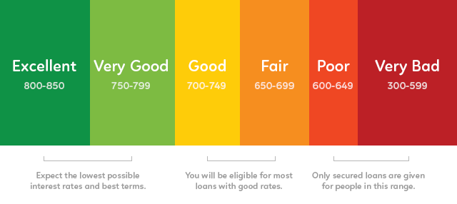

========================================================


# Introduction

This report explores a data set containing 113,937 [Prosper](https://www.prosper.com/home/) 
loans. Prosper specializes is peer-to-peer (P2P) lending, allowing everyday 
people to both acquire and invest in loans for amounts ranging from \$2,000 to 
$35,000. Prosper provides data to both potential borrowers and investors about 
their loans, with borrower data focused on the rate they will get on the loan, 
and investor data focuesed on the estimated return on investment.

The data set has 81 variables associated with each loan, such as: loan amount, 
borrower rate (i.e., interest rate), loan status, borrower income, borrower
employment status, borrower credit history, estimated return for investors, etc. 
A description of each attribute in the loan dataset is provided [here](https://docs.google.com/spreadsheets/d/1gDyi_L4UvIrLTEC6Wri5nbaMmkGmLQBk-Yx3z0XDEtI/edit#gid=0).

I will approach this analysis from the viewpoint of a potential investor. The 
data set provides information on both outstanding and closed outloans, so 
hopefully we can gain some insight on actual versus estimated return on 
investment. Do prosper loans live up to the hype? 

Let's start by setting up our workbook with the necessary packages, and loading
in the dataset to get a sense of the variables available.

```{r echo=FALSE, message=FALSE, warning=FALSE}
library(tidyverse)
library(lubridate)
library(scales)
library(knitr)

# Greg's Dell 3520 (work)
setwd("C:/Users/clu73519/Repos/Udacity/Exploratory_Data_Analysis/p6_explore_and_summarize_data")


# Greg's macbook
# setwd("/Users/GregoryClunies/Repos/Udacity/Exploratory_Data_Analysis/p6_explore_and_summarize_data")
```

```{r echo=FALSE, message=FALSE, warning=FALSE}
# Load the Data
loan_orig <- read.csv("prosperLoanData.csv")

# data shape, structure, etc. info
# dim(loan_orig)
# str(loan_orig)

# not sure why dplyr rename function not workin??
# rename(loan, 
#        ProsperRating..numeric. = ProsperRatingNumeric, 
#        ProsperRating..Alpha. = ProsperRatingAlpha, 
#        ListingCategory..numeric. = ListingCategory)

# rename columns that give trouble later on
library(data.table)
setnames(loan_orig, old = c("ProsperRating..numeric.", "ProsperRating..Alpha.", 
                            "ListingCategory..numeric."),
        new = c("ProsperRatingNumeric", "ProsperRatingAlpha", "ListingCategory")
        )

library(dplyr)  # make sure dplyr functions are default, not data.table functions

# convert the date attributes to POSIXct format to handle dates
loan_orig$ListingCreationDate <- ymd_hms(loan_orig$ListingCreationDate)
loan_orig$ClosedDate <- ymd_hms(loan_orig$ClosedDate)

# drop HH:MM:SS data from creation date (not relevant to this analysis)
loan_orig$ListingCreationDate <- floor_date(loan_orig$ListingCreationDate, 
                                            unit = "day")

# print("First and Last loan creation dates:")
# min(loan_orig$ListingCreationDate)
# max(loan_orig$ListingCreationDate)
```

Before diving into univariate, bivariate and multivariate analysis. Let's get an
idea of how Propser has done over the time period of the provided data. Is the 
Prosper service growing, stagnant, or decreasing over time?

```{r echo=FALSE, message=FALSE, warning=FALSE}
binwidth = 60*60*24*7  # 1-week bin width (in seconds)
date_limits = c(ymd(2005, 11, 09), ymd(2014,03,9))

ggplot(data = loan_orig, aes(x = ListingCreationDate)) + 
  geom_freqpoly(binwidth = binwidth) +
  scale_x_datetime(breaks = date_breaks("years"), labels = date_format("%Y")) +
  ylab("weekly loans created")
```

From the plot above, we see a drop in loan creation starting roughly around the
3rd quarter of 2008, lasting through quarter 2 in 2009... what's going on here? 

Some quick research via google and [wikipedia](https://en.wikipedia.org/wiki/Prosper_Marketplace#Cease_and_desist_order) states that in 2008 the SEC found
Prosper to be in violation of the Securities Act of 1933 and forced Prosper to
stop issuing loans. After some some rounds of litigation, and restructing of the
underlying securities (now SEC regulated), Prosper reopened their P2P 
marketplace to continue issuing loans to borrowers and providing investment 
opportunities to investors.

For consistency, I will only analyze the data post SEC relaunch (July 2009
onwards) as it seems the data set itself underwent some structural changes 
(see variable descriptions) during the litigation phase. 

```{r echo=FALSE, message=FALSE, warning=FALSE}
loan <- subset(loan_orig, ListingCreationDate >= as.POSIXct("2009-07-01",
                                                       format="%Y-%m-%d"))
```

Since mid 2009 we see a significant increase in issued loans via Prosper
Marketplace. We also see what looks to be an increase in volatility in the 
number of weekly loans created. I wonder what is driving this volatility?

After getting some background infromation on Prosper and a brief 
look at their history and growth, let's begin with some univariate analysis.

# Univariate Plots Section

As an investor, and in a sense a lender (via Prosper), I am interested in 
learning about who borrows money using Prosper. I don't think its unreasonable 
to assume that most borrowers are likely using Prosper as an alternative to 
traditional banks (perhaps due to a lack of eligibilty?), and therefore may pose
a risky investment. As a result, I'll start with their credit score of borrowers
as a baseline. 

```{r echo=FALSE, message=FALSE, warning=FALSE}
# create a estimate of credit score (approx. center of lower and upper range)
loan$CreditScore <- (loan$CreditScoreRangeLower +
                       loan$CreditScoreRangeUpper)/2 + 0.5

ggplot(data = loan, aes(x = CreditScore)) +
  geom_histogram(binwidth = 20, color = "black", fill = "blanchedalmond") +
  scale_x_continuous(breaks = seq(600,900,20)) +
  theme(axis.text.x = element_text(angle = 45, hjust = 1))
```



I have included a figure for showing the corresponding FICO categories above as

Based on the ranges, it appears most borrowers have a "Fair" credit score.
As expected, there are less borrowers with higher credit scores (right skewed 
distribution).

It would also be good to get a sense of how many credit lines borrowers have, as 
we may want to avoid borrowers with a lot of liabilities.

```{r echo=FALSE, message=FALSE, warning=FALSE}
ggplot(data = loan, aes(x = CurrentCreditLines)) +
  geom_histogram(binwidth = 1, color = "black", fill = "darkorange") +
  scale_x_continuous(breaks = seq(0,40,5))
```
 Most borrowers on prosper have around 8 lines of credit. Some borrowers have as
 much as 40 lines of credit! Unsurprisingly, the distribution is right skewed.
 
 Next, I'll get an idea of the incomes, employement status, and debt-to-income 
 ratios for borrowers.
 
```{r echo=FALSE, message=FALSE, warning=FALSE}
ggplot(data = subset(loan, IncomeVerifiable == 'True'),
       aes(x = StatedMonthlyIncome*12)) +
  geom_histogram(binwidth = 10000, color = "black", fill = "chartreuse3") +
  scale_x_continuous(breaks = seq(0, 300000, 10000), limits = c(0,300000)) +
    theme(axis.text.x = element_text(angle = 45, hjust = 1)) +
  xlab("Yearly Income")

ggplot(data = subset(loan, IncomeVerifiable == 'True'),
       aes(x = DebtToIncomeRatio)) +
  geom_histogram(binwidth = 0.1, color = "black", fill = "red") +
  scale_x_continuous(breaks = seq(0,1.5,0.1),limits = c(0,1.5))


kable(table(loan$IncomeVerifiable), 
      col.names = c("Verifiable Income", "n"))

e_status <- table(loan$EmploymentStatus)
kable(e_status[2:nrow(e_status)],
      col.names = c("Employement Status", "n"))

p_EmploymentStatus <- table(loan$EmploymentStatus)/dim(loan)[1]
kable(p_EmploymentStatus[2:nrow(p_EmploymentStatus)],
      col.names = c("Employement Status", "Proportion"))

summary(loan$DebtToIncomeRatio)

```

**Note:** Only the loans where a borrower had a verifiable income are shown in 
the above plots (91% of all loans). Also, incomes greater than $300k are not 
shown as the tail becomes imperceptibly thin beyond this value. As expected, the 
distribution of incomes is right skewed.

Most borrowers have a income of around $50,000 and a debt to income ratio of 
0.2. Most borrowers are also employed (79%).

It might also be helpful to see the status of the loans issued using Prosper 
since 2009 to get an idea of how they are performing in a general sense. Are 
a large number of borrowers overdue on their loan payments? Have they defaulted?
How many loans have been written off? How many were succesfully completed?

```{r echo=FALSE, message=FALSE, warning=FALSE}
ggplot(data = loan, aes(x = LoanStatus)) + 
  geom_bar() +
  coord_flip() +
  scale_y_log10(breaks = c(0,10,100,1000,10000, 50000)) 

kable(table(loan$LoanStatus), col.names = c("Loan Status", "n"))
kable(table(loan$Term), col.names = c("Loan Term", "n"))
```

Between July 2009 and the last update of this data (03/11/2014), 19664 Prosper 
loans had been completed, 56576 loans were currently issued, 997 loans were in 
default (extended period in which borrower has not paid), 5326 had been charged 
off (money owed, but creditor has given up on collecting = BAD DEBT), 2067 loans
were past due, and 205 were in final processing.

Prosper also provides some additional proprietary parameters (Prosper [Scores](https://www.prosper.com/plp/general-prosper_score/) & Prosper
[Ratings](https://www.prosper.com/plp/invest/prosper-ratings/)) of loan quality to investors.
Prosper Scores help estimate the the probability of the loan going bad (going 60+ days past
due in first year of loan), whereas the Prosper Rating appears to be a
more overall description of loan risk. Remember, both are proprietary 
parameters provided by Prosper to potential investors. I'll take a look at them 
quickly.

```{r echo=FALSE, message=FALSE, warning=FALSE}
# re order the ProsperRating Alpha factor (AA is higehr than A)
loan$ProsperRatingAlpha <- factor(loan$ProsperRatingAlpha, 
                                levels = c("AA", "A", "B", "C", "D", "E", "HR"))

ggplot(data = loan, aes(x = ProsperRatingAlpha)) +
  geom_bar()

ggplot(data = loan, aes(x = ProsperScore)) +
  geom_bar()
```

Next, I will take a look at the rates most borrowers get and the estimated 
returns for investors.
```{r echo=FALSE, message=FALSE, warning=FALSE}
ggplot(data = loan, aes(x = BorrowerRate)) + 
  geom_histogram(binwidth = 0.01) +
  scale_x_continuous(breaks = seq(0, 0.4, 0.01)) +
  theme(axis.text.x=element_text(angle=45,hjust=1)) 

ggplot(data = loan, aes(x = EstimatedReturn)) + 
  geom_histogram(binwidth = 0.01)

summary(loan$EstimatedReturn)
```

It looks like most borrowers get a rate around 0.15 to 0.2 (median 0.1875), but 
we can see that a substational amount of borrowers get rates around 0.26. This 
distrubution is definitely not normal. Shockingly, we see that the most common 
rate for borrowers is 0.32 (32%)! 

Estimated returns appear to follow a much more normal distrubution with a median
estimated return of 0.09211 (9%). A very few number of loans are actually
predicted to provide negative returns from the outset. Steer clear of these!

Although the estimated return for a loan is certainly information I would like 
when trying to choose one loan over the other. I think it is worth taking a look
at actual loan performance. Unfortuantely, Prosper does not make this 
information available so we need to do a bit of work to tease this out of the 
data set.

I will use the following formula to calculate the *Actual Return* also
known as the cumalative return, $R_c$ ([Source](https://www.fool.com/knowledge-center/annualized-return-vs-cumulative-return.aspx)).

$$R_c = (LP_{CustomerPrincipalPayments} + LP_{InterestandFees} + 
LP_{CollectionFees} - P)/ P$$

Where `P` is the loan principal (or the LoanOriginalAmount)

Obviously, we can only assess the loans that are completed (i.e., have a closing
date) for this information to be a true measure of actual loan returns.

```{r echo=FALSE, message=FALSE, warning=FALSE}
loan_completed <- loan %>% 
  dplyr::filter(!is.na(ClosedDate))  #specify to use dplyr's filter function

loan_completed$ActualReturn <- with(loan_completed, 
  (LP_CustomerPrincipalPayments + LP_InterestandFees +
     LP_CollectionFees - LoanOriginalAmount)/LoanOriginalAmount)

ggplot(data = loan_completed, aes(x = ActualReturn)) +
  geom_histogram(breaks = seq(-1.0,1.0,0.02), fill="orange", color="black") +
  geom_vline(xintercept = 0, linewidth = 4, linetype = 2, color = "red")
```

Descriptive Statistics for loans that lose money:
```{r echo=FALSE, message=FALSE, warning=FALSE}
summary(subset(loan_completed, ActualReturn >= 0)$ActualReturn)
```

Descriptive Statistics for loans that lose money:
```{r echo=FALSE, message=FALSE, warning=FALSE}
summary(subset(loan_completed, ActualReturn < 0)$ActualReturn)
```

Now this is some useful information! We can see that most loans have positive 
returns, which is expected otherwise Prosper would not be in business long! 
However, there are definitely loans that lose money for investors as well.
Curiously, when a loan turns out to be a losing bet it more often than not tends
to lose **BIG**. Both the positive and negative return loans are right skewed in
their resepctive distributions (red dashed line at a return rate of 0.0).


# Univariate Analysis

### What is the structure of your dataset?

The original structure of the data set is 113937 row (one for each loan) by 83
variables per loan.

Some cleaning was done to allow for easy handling of loan date information 
(convert to POSIXct). As stated earlier, only loans after 2009 are used in 
this analysis to ensure structural consistency of the data set.

In addition some variables were added to the data set which now contains records
for 84,853 loans (rows) with 82 variables for each loan (columns). 

A 83rd variable was also created, but only for the completed loans, which is 
stored in a separate data frame called `loan_completed`.

### What is/are the main feature(s) of interest in your dataset?

The main features of the dataset include:
- Loan date/timing information (e.g., start date, end date)
- Borrower information (e.g., credit score, income, etc.)
- Loan quality informmation (e.g., Prosper Score, Prosper Rating)
- Estimated loan perfromance information for investors (e.g., estimated returns)


### What other features in the dataset do you think will help support your analysis?

I think the geogrpahic information will be interesting to investigate against 
the other variables. Do loans from certain geographies perform
better than others? Perhaps a similar analysis could be done using loan listing
categories or the borrowers occupation - are certain careers associated with 
more reliable borrowers?

### Did you create any new variables from existing variables in the dataset?

Two variables were created to aid in this analysis:

1. CreditScore - midpoint of the credit range the borrower was classified in.
2. ActualReturns - calculated return for all closed out loans. 

These variables will help later during the bivariate and multivariate analysis. 
Hopefully, they can be used to some light on the type of loans that result in 
higher returns, and evaluate how well Prosper's rating and scoring parameter 
represent true loan perfromance.


### Of the features you investigated, were there any unusual distributions? \

First, looking at weekly loans created was surprising as this shed some light on
the growth of the Propser P2P marketplace and forced me to further investigate
Prosper's business model. Knowing that the Propser marketplace is regulated by 
the SEC does provide some more confididence that there is some oversight into 
the business as a whole. Though this does not mean you can't lose money!.

Borrower rates showed an unusual distribution. Though partially right skewed, 
there are some clear spikes at higher rates. This suggests that Prosoper 
thinks most of it's borrowers are a higher investment risk. Strangely, we don't 
see a similar distibution in the Prosper Rating and Score of loans.

I was also surpised by the distribution of the negtaive ActualReturns 
(laons that lost money) were right skewed, which suggests that when borrowers 
stop making loan payments they tend to do so early on in the loan cycle, which 
leads to a higher loss as a percentage of the original loan value and investment
by investors.


# Bivariate Plots Section

With some idea of the financial situation of borrowers using Prosper, let's take
a look at where most of the loans are originating from (by state) and what the 
loans are being used for.

```{r echo=FALSE, message=FALSE, warning=FALSE}
# download shapefile from web 
# comment out 2 lines below after downloading, otherwise code hangs, since file already in working directory
# download.file("http://www2.census.gov/geo/tiger/GENZ2017/shp/cb_2017_us_state_500k.zip", destfile="states_shape_file.zip")
# system("unzip states_shape_file.zip")

library(rgdal)
library(leaflet)
state_spdf <- readOGR( dsn= getwd() , layer="cb_2017_us_state_500k")

# Look at the info provided with the geospatial object
head(state_spdf@data)
summary(state_spdf@data)

# summarise data by state
loan.count_by_state <- loan %>% 
  group_by(BorrowerState) %>% 
  summarise(n_loans = n())

# Add loan counts to state_spdf
state_spdf <- merge(state_spdf, loan.count_by_state, by.x = "STUSPS", 
                    by.y = "BorrowerState")

# Create a color palette with handmade bins.
mybins <- c(seq(0,10000,1000), Inf)
mypalette <- colorBin( palette="YlOrBr", domain=state_spdf@data$n_loans, 
                       na.color="transparent", bins=mybins)

# Prepar the text for the tooltip:
mytext=paste("State: ", state_spdf@data$STUSPS,"<br/>", 
             "No. of Loans: ", state_spdf@data$n_loans, "<br/>",
             sep=""
             ) %>% 
  lapply(htmltools::HTML)

leaflet(state_spdf) %>% 
  addTiles()  %>% 
  setView( lat=40, lng=-99 , zoom=3) %>%
  addPolygons( 
    fillColor = ~mypalette(n_loans),
    stroke=TRUE,
    fillOpacity = 0.9,
    color="white",
    weight=0.3,
    label = mytext,
    labelOptions = labelOptions( style = list("font-weight" = "normal", 
                                              padding = "3px 8px"),
                                 textsize = "13px", 
                                 direction = "auto")) %>%
  addLegend( pal=mypalette,
             values=~n_loans,
             opacity=0.9,
             title = "No. of Loans",
             position = "bottomleft" )

```

**Note**: Much of the plotting technique for the choropleth plot of the U.S. 
states was adapted from [this example](https://www.r-graph-gallery.com/183-choropleth-map-with-leaflet/) (Source: The R Graph Gallery).

We can see on the above interactive chloropleth plot that Califronia has the 
most loans of any state in the data set, with 10,761 loans. We can also see that
5 states in particular stand out from the rest (>4000 lonas):

- California (10,761)
- New York (5,844)
- Texas (5,634)
- Florida (5,406)
- Illinios (4,264)

California may stand out above the rest because of the heavy tech presence where
awareness of Prosper is likely the greatest. I would guess that the other states
have higher loan counts for a similar reason, as they major cities that likely 
have established tech scenes or strong brand awareness. An altrenative reason 
could be that these states simply have more citizens who are looking for 
alternative financing, or larger populations in general.

Earlier we looked at distributions for different types pf borrower information, 
let's now take a look at how some of these variables are related. As I am a 
potential investor, I will stick to looking at only the data for completed 
loans, as this gives the most complete picture of loan performance relative to 
the variables shown by Prosper when a loan is first available to investors. 

Since there are 83 variables, I will need to trim down the number of variables I
will look at to ensure this analysis doesn't get too long! Let's start with the 
following list:

- ListingCreationDate
- Term
- LoanStatus
- BorrowerRate 
- EstimatedReturn
- ProsperRatngAlpha
- ProsperScore
- BorrowerState
- EmploymentStatus
- ListingCategory
- CreditScore
- StatedMonthlyIncome
- DebtToIncomeRatio
- MonthlyLoanPayment
- LoanOriginalAmount
- ActualReturn

```{r echo=FALSE, message=FALSE, warning=FALSE}
# get subset data.frame with only the columns listed above
columns = c("ListingCreationDate", "Term","LoanStatus", "BorrowerRate", 
            "EstimatedReturn", "ProsperRatingAlpha", "ProsperScore", 
            "BorrowerState", "EmploymentStatus", "ListingCategory",
            "CreditScore", "StatedMonthlyIncome", "DebtToIncomeRatio",
            "LoanOriginalAmount", "MonthlyLoanPayment", "ActualReturn")

df_loan <- subset(loan_completed, select = columns)
```

I'll start by seeing if certain loan Term lengths (12, 36, 60 months) result in 
more positive outcomes for investors (Completed vs. Defaulted or Charged off). 

```{r echo=FALSE, message=FALSE, warning=FALSE}
ggplot(data = df_loan, aes(x = Term,  fill=LoanStatus)) +
  geom_bar(position = "dodge") +
  scale_x_continuous(breaks = c(12, 36, 60)) + 
  scale_y_log10(breaks = c(10, 100, 500, 1000, 5000, 10000))


loan.count_by_term_status<- df_loan %>% 
  group_by(Term, LoanStatus) %>%
  summarise(n_loans = n()) %>%
  mutate(freq = n_loans / sum(n_loans))

kable(loan.count_by_term_status, caption = "Loan Term vs. Loan Status Summary Table")
```

We see that based on the historical data (remember, we are only reviewing 
completed loans) that the 12 month Term loans result in less defaults or 
charge-offs, I wonder what the distribution of Estimated and Actual Returns are
for loans of different term lengths. 

```{r echo=FALSE, message=FALSE, warning=FALSE}

loan.Avg_Return_by_Term <- df_loan %>% 
  group_by(Term) %>% 
  summarise(mean_ActualReturn = mean(ActualReturn),
            median_ActualReturn = median(ActualReturn))

ggplot(data = df_loan, aes(x = EstimatedReturn, y = ..count..+1,group = Term, 
                           fill = factor(Term))) +
  geom_histogram(position="identity",alpha=0.5, binwidth = 0.05) +
  scale_y_log10(breaks = c(10, 100, 1000, 5000)) + 
  ylab("count") +
  scale_fill_discrete(name = "Term")

ggplot(data = df_loan, aes(x = ActualReturn, y = ..count..+1,group = Term, 
                           fill = factor(Term))) +
  geom_histogram(position="identity",alpha=0.5, binwidth = 0.05) +
  scale_y_log10(breaks = c(10, 100, 1000, 5000)) + 
  ylab("count") +
  scale_fill_discrete(name = "Term")

kable(loan.Avg_Return_by_Term, caption = "Mean Return on loan by Term")
```

The first thing I see is that the distribution for the Estimated and Actual 
returns are noticeabley different when split up by Term length. The estimated 
returns tend to be much less extreme in general (not as many big losses or 
excellent returns) when compared to the distrtibutions of the Actual returns.

Looking at the Actual returns more closely, we can see that all loan term 
lengths have both postive and negative Actual Returns (not the case for the 
estimated distributions), but we see that the 12 month terms have a "tighter" 
distribution, with not as extreme losses or extreme gains (+ve return) either. 
36 month loan terms have the widest distribution with the largest range in 
Actual Returns, with 60 month terms falling in between. 

Another interesting observation when looking at the distributions is that if if 
I were to only use the estimated distributions above in selecting loans, I would
tend towards 60 month loans as they're estimated (remember, this is Prosper's 
estimate!) to have limited downside with reasonable returns on average. But, 
after looking at the distributions for Actual returns, I would actually feel 
better selecting 12 month loans as they have historically resulted in less 
losses when compared to 36 and 60 month loans.

Further, looking at the summary table of mean and median Actual Returns by term,
we see that on average 36 month terms have the highest return. But after looking
at the distributions, we also know that they have the largest range in Actual 
Returns, with some 36-month loans posting huge losses or providing big returns 
for investors. I think it is fair to treat the width of the distribution of 
actual returns for each loan term as a rough metric of the loan's risk profile.
The phrase "big risk, big reward" seems to ring true with the 36-month loans.

Interestingly, loans with 12 month terms tend out perform loans with 60 month 
terms (on average), but with a noticeably tighter distributions. This means that
based on the historical loan data, we might estimate that we can get similar 
average returns from the 12 month loans as the 60 month loans (actually slightly
higher based on this data), but with less risk for catostrophic losses. This 
comparison of central tendencies between the 12-month and 60-month loans does 
not capture the fact that 60-month loans have at times resulted in higher Actual
Returns than the 12-month loan, again due to the wider distribution of returns.

Based on the above discussion, it seems there are some fairly large 
discrepancies bewteen Estimatedand Actual returns. Knowing that Prosper 
generates these estimates internally, I wonder if they have immproved their 
ability to more accurately represent Actaul loan perfromance with their 
Estimated returns as they have evolved as a company and lending platform over 
time?


```{r echo=FALSE, message=FALSE, warning=FALSE}
df_loan$Actual_less_Estimated_Return <- df_loan$ActualReturn - df_loan$EstimatedReturn


binwidth = 60*60*24*7  # 1-week bin width (in seconds)
date_limits = c(ymd(2005, 11, 09), ymd(2014,03,9))

ggplot(data = df_loan, aes(x = ListingCreationDate, 
                           y = Actual_less_Estimated_Return)) + 
  geom_point(alpha = 1/20) +
  geom_smooth() +
  scale_x_datetime(breaks = date_breaks("years"), labels = date_format("%Y")) +
  scale_y_continuous(breaks = seq(-1.5,0.8,0.1)) +
  ylab("(Actual Return) - (Estimated Return)")+
  geom_hline(yintercept = 0, color = "red", linetype = 2, size = 1)
```

Based on the GAM fit (learn more about GAM fitting [here](https://multithreaded.stitchfix.com/blog/2015/07/30/gam/))
(blue line), it looks like the difference between Estimated and Actual returns 
for loans has varied over time. Between 2009 and 2011 we see that, in general, 
Actual returns often exceeded estimated returns. However, after 2011 we see that
Actual returns are more frequently less than the Estimated return, though 
grossly innacurate Estimated returns are still the minority. 

Let's see if there are other variables that correlate well with Actual returns
as this is what we are after as prospective investors.

```{r echo=FALSE, message=FALSE, warning=FALSE}
ggplot(data = df_loan, 
       aes(x = BorrowerRate, y = ActualReturn)) +
  geom_jitter(width = 0.01, alpha = 1/20) +
  geom_smooth(method="lm")
```

Correlation - Borrower Rate vs. Actual Return: 
```{r echo=FALSE, message=FALSE, warning=FALSE}
round(cor(df_loan$BorrowerRate, df_loan$ActualReturn),2)
```

```{r echo=FALSE, message=FALSE, warning=FALSE}
ggplot(data = df_loan, 
       aes(x = ProsperRatingAlpha, y = ActualReturn)) +
  geom_jitter(width = 0.25, alpha = 1/20) +
  geom_smooth(method="lm")
```

Correlation - Prosper Rating Alpha vs. Actual Return: 
```{r echo=FALSE, message=FALSE, warning=FALSE}
round(cor(as.numeric(df_loan$ProsperRatingAlpha), df_loan$ActualReturn),2)
```

```{r echo=FALSE, message=FALSE, warning=FALSE}
ggplot(data = df_loan, 
       aes(x = ProsperScore, y = ActualReturn)) +
  geom_jitter(width = 0.2, alpha = 1/20) +
  geom_smooth(method="lm")
```

Correlation - Prosper Score vs. Actual Return: 
```{r echo=FALSE, message=FALSE, warning=FALSE}
round(cor(df_loan$ProsperScore, df_loan$ActualReturn),2)
```


```{r echo=FALSE, message=FALSE, warning=FALSE}
ggplot(data = df_loan, 
       aes(x = EmploymentStatus, y = ActualReturn)) +
  geom_jitter(width = 0.25, alpha = 1/20) +
  geom_smooth(method="lm")
```

Correlation - Employement Status vs. Actual Return: 
```{r echo=FALSE, message=FALSE, warning=FALSE}
round(cor(as.numeric(df_loan$EmploymentStatus), df_loan$ActualReturn),2)
```


```{r echo=FALSE, message=FALSE, warning=FALSE}
ggplot(data = df_loan, 
       aes(x = ListingCategory, y = ActualReturn)) +
  geom_jitter(width = 0.25, alpha = 1/20) +
  geom_smooth(method="lm")
```

Correlation - Listing Category vs. Actual Return: 
```{r echo=FALSE, message=FALSE, warning=FALSE}
round(cor(as.numeric(df_loan$ListingCategory), df_loan$ActualReturn),2)
```


```{r echo=FALSE, message=FALSE, warning=FALSE}
ggplot(data = df_loan, 
       aes(x = CreditScore, y = ActualReturn)) +
  geom_point(alpha = 1/20) +
  geom_smooth(method="lm")
```

Correlation - Credit Score vs. Actual Return: 
```{r echo=FALSE, message=FALSE, warning=FALSE}
round(cor(df_loan$CreditScore, df_loan$ActualReturn),2)
```


```{r echo=FALSE, message=FALSE, warning=FALSE}
ggplot(data = subset(df_loan, StatedMonthlyIncome <= 50000), 
       aes(x = StatedMonthlyIncome, y = ActualReturn)) +
  geom_point(alpha = 1/20) +
  scale_x_continuous(limits = c(0,50000)) +
  geom_smooth(method="lm")
```

Correlation - Monthly Income vs. Actual Return: 
```{r echo=FALSE, message=FALSE, warning=FALSE}
round(cor(df_loan$StatedMonthlyIncome, df_loan$ActualReturn),2)
```

```{r echo=FALSE, message=FALSE, warning=FALSE}
ggplot(data = df_loan, 
       aes(x = MonthlyLoanPayment, y = ActualReturn)) +
  geom_point(alpha = 1/20) +
  geom_smooth(method="lm")
```

Correlation - Monthly Loan Payment vs. Actual Return: 
```{r echo=FALSE, message=FALSE, warning=FALSE}
round(cor(df_loan$MonthlyLoanPayment, df_loan$ActualReturn),2)
```


```{r echo=FALSE, message=FALSE, warning=FALSE}
ggplot(data = df_loan, 
       aes(x = LoanOriginalAmount, y = ActualReturn)) +
  geom_point(alpha = 1/20) +
  geom_smooth(method="lm")
```

Correlation - Loan Amount vs. Actual Return:
```{r echo=FALSE, message=FALSE, warning=FALSE}
round(cor(df_loan$LoanOriginalAmount, df_loan$ActualReturn),2)
```

From the above scatter plots and correlation coefficients (note: some factor 
variables were converted to numeric variables to calculate correlation), we see 
that none of the selected variables are well correlated with the Actual return a
loan provides to an investor. It would appear that estimating a loan's 
performance requires careful consideration of multiple variables. Not 
surprisingly, the Prosper Score is the best correlated (out of the varibales 
investigated) with Actual returns, which makes some sense as Prosper claims the
Score accounts for multiple factors in assessing a loans likelihood of going bad
(1 = worst score, 11 = best socre), or inversely not going bad.

# Bivariate Analysis

### Talk about some of the relationships you observed in this part of the \
analysis

From the viewpoint of an investor, I was surprised to see how little correlation
there was between the variables I investigated with the Actual Returns of 
completed loans. Even well established metrics like a Borrower's credit score, 
which affect all of our financial purchases/loans were not a good predictor of a
loan's ability to provide good returns. As stated earlier, the art of predicting
loan performance is clearly more complicated and is influence by a codination of
factors.

### Did you observe any interesting relationships between the other features \

I was interested that when reviewing the distributions of Estimated and Actual 
returns (grouped by loan Term) that although the distributions of Estimated 
returns might entice investors to lean towards 60 month loans, the Actual return
distributions suggested that 12 month loans may in fact be safer. In general, 
the  median Actual returns for 12 and 60 month term loans were comparable (~5%),
but the 12 month loans had a noticebaly tighter distribution - suggesting less 
risk of huge losses but also less opportunity of big returns.

### What was the strongest relationship you found?

The strongest relationship I found was between the Prosper Score and Actual 
return, though still quite weak with a correlation of only 0.13.

# Multivariate Plots Section

Let's see if we can get a better idea of suitable borrowers by pairing Credit 
Scores grouped by Prosper Ratings and comparing them to Actual Returns.

```{r echo=FALSE, message=FALSE, warning=FALSE}
ggplot(data = loan_completed, 
       aes(x = CreditScore, 
           y = ActualReturn, 
           color = factor(ProsperRatingAlpha))) +
  geom_jitter(width = 5, alpha = 1/20) +
  guides(colour = guide_legend(override.aes = list(alpha = 1))) +
  geom_smooth(method = "lm", se=FALSE) +
  scale_fill_discrete(name = "Prosper Rating (Alpha)")


cor_by_ProsperRatingAlpha <- loan_completed %>% 
  group_by(factor(ProsperRatingAlpha)) %>% 
  summarise(correlation = cor.test(CreditScore, ActualReturn)$estimate)

kable(cor_by_ProsperRatingAlpha, 
      caption = "Correlation: Credit Score vs. Actual return",
      col.names = c("Credit Rating", "Correlation"))
```

Compared to the earlier plot comparing Credit Score to Actual Returns alone (no 
grouping), this plot provides some useful additional information. We can see 
that loans with borrowers having a lower Propser Rating (e.g., HR to D) have a 
much larger range in outcomes for investors, ranging from losses up to 100% to 
returns greater than 50%! Borrowers with higher ratings (e.g., A and AA) apprear 
to be less likely to result in losses for investors, but the returns are also 
much more tempered, topping out around approximately 20%, but more often in the 
range of 5 - 10%. 

The linear models of Credit Score vs. Actual returns for each Prosper Rating are
distinctinly different. Interestingly, for the the highest three Prosper Ratings
(B - AA), we see *positive* slopes for the linear fit, but for the lower ratings
(HR-C) we see a *negative* slopes. This suggests that for the the lower Prosper 
Ratings an increase in the Credit score of the borrower would predict a decrease
in loan return for the investor, this seems counter intuitive. 

These negative slope lines might also suggest some suspicious discrepancies 
between Credit Score and Prosper Rating; I would pose the question if it seems 
likely that a borrower with a Credit Score above 800 (an excellent score) would 
be assigned a Prosper Rating of HR?

Earlier, we looked at differences in the distribution of Estimated returns and 
Actual returns, now let's see if we can identify sub groups (using group_by) 
where estimated and actual returns are more aligned. This might help us select a
type of borrower/loan we might be interested in funding. Each plot will show the
trendline for each subgroup relative to a 1:1 line (idealized case where 
Estimated Return=ActualReturn). I will also include the corresponding Pearson 
correlation coefficients so we can get a sense of the strength of the linear 
relationship (if at all) for each group. Recall the groups we used previously:

- ListingCreationDate (not evaluated)
- Term
- LoanStatus (not evaluated)
- BorrowerRate 
- EstimatedReturn
- ProsperRatingAlpha
- ProsperScore
- BorrowerState
- EmploymentStatus
- ListingCategory
- CreditScore
- StatedMonthlyIncome
- DebtToIncomeRatio
- MonthlyLoanPayment
- LoanOriginalAmount
- ActualReturn

```{r echo=FALSE, message=FALSE, warning=FALSE}
# Loan term
ggplot(data = df_loan, aes(x = EstimatedReturn,
                           y = ActualReturn,
                           color = factor(Term))) +
  geom_point(alpha = 1/20) +
  scale_x_continuous(limits = c(0, 0.2)) +
  scale_y_continuous(limits = c(-1.0, 0.8)) +
  geom_smooth(method = "lm") +
  geom_abline(slope=1, intercept=0, linetype=2) +
  scale_fill_discrete(name = "Term")

g_cor_Term <- df_loan %>% 
  group_by(Term) %>% 
  summarize(correlation = cor.test(EstimatedReturn, ActualReturn)$estimate)

kable(g_cor_Term, caption = "Estimated vs Actual Return - by Term")

# Borrower Rate
ggplot(data = subset(df_loan,!is.na(cut(BorrowerRate,seq(0,0.3,0.1)))), 
       aes(x = EstimatedReturn,
           y = ActualReturn,
           color = cut(BorrowerRate,seq(0,0.3,0.1)))
       ) +
  geom_point(alpha = 1/20) +
  scale_x_continuous(limits = c(0, 0.2)) +
  scale_y_continuous(limits = c(-1.0, 0.8)) +
  geom_smooth(method = "lm") +
  geom_abline(slope=1, intercept=0, linetype=2) +
  scale_fill_discrete(name = "Borrower Rate")

g_cor_BorrowerRate <- subset(df_loan,!is.na(cut(BorrowerRate,seq(0,0.3,0.1)))) %>% 
  group_by(cut(BorrowerRate,seq(0,0.3,0.1))) %>% 
  summarize(correlation = cor.test(EstimatedReturn, ActualReturn)$estimate)

kable(g_cor_BorrowerRate, caption = "Estimated vs Actual Return - by Borrower Rate")

#Prosper Rating (Alpha)
ggplot(data = df_loan, aes(x = EstimatedReturn,
                           y = ActualReturn,
                           color = ProsperRatingAlpha)) +
  geom_point(alpha = 1/20) +
  scale_x_continuous(limits = c(0, 0.2)) +
  scale_y_continuous(limits = c(-1.0, 0.8)) +
  geom_smooth(method = "lm") +
  geom_abline(slope=1, intercept=0, linetype=2) +
  scale_fill_discrete(name = "Prosper Rating (Alpha)")

g_cor_ProsperRatingAlpha <- df_loan %>% 
  group_by(ProsperRatingAlpha) %>% 
  summarize(correlation = cor.test(EstimatedReturn, ActualReturn)$estimate)

kable(g_cor_ProsperRatingAlpha, caption = "Estimated vs Actual Return - by Borrower Rate")


#Prosper Score
ggplot(data = df_loan, aes(x = EstimatedReturn,
                           y = ActualReturn,
                           color = cut(ProsperScore,seq(0,11,1)))) +
  geom_point(alpha = 1/20) +
  scale_x_continuous(limits = c(0, 0.2)) +
  scale_y_continuous(limits = c(-1.0, 0.8)) +
  geom_smooth(method = "lm") +
  geom_abline(slope=1, intercept=0, linetype=2) +
  scale_fill_discrete(name = "Prosper Score")

g_cor_ProsperScore <- df_loan %>% 
  group_by(cut(ProsperScore,seq(0,11,1))) %>% 
  summarize(correlation = cor.test(EstimatedReturn, ActualReturn)$estimate)

kable(g_cor_ProsperScore, caption = "Estimated vs Actual Return - by Prosper Score")


#Borrower State
ggplot(data = df_loan, aes(x = EstimatedReturn,
                           y = ActualReturn,
                           color = BorrowerState)) +
  geom_point(alpha = 1/20) +
  scale_x_continuous(limits = c(0, 0.2)) +
  scale_y_continuous(limits = c(-1.0, 0.8)) +
  geom_smooth(method = "lm", se = FALSE)  +
  geom_abline(slope=1, intercept=0, linetype=2) +
  scale_fill_discrete(name = "Borrower State")

g_cor_BorrowerState <- df_loan %>% 
  group_by(BorrowerState) %>% 
  summarize(correlation = cor.test(EstimatedReturn, ActualReturn)$estimate)

kable(g_cor_BorrowerState, caption = "Estimated vs Actual Return - by Borrower State")


# Employment Status
ggplot(data = df_loan, aes(x = EstimatedReturn,
                           y = ActualReturn,
                           color = EmploymentStatus)) +
  geom_point(alpha = 1/20) +
  scale_x_continuous(limits = c(0, 0.2)) +
  scale_y_continuous(limits = c(-1.0, 0.8)) +
  geom_smooth(method = "lm", se = FALSE) +
  geom_abline(slope=1, intercept=0, linetype=2) +
  scale_fill_discrete(name = "Employment Status")

g_cor_EmploymentStatus <- df_loan %>% 
  group_by(EmploymentStatus) %>% 
  summarize(correlation = cor.test(EstimatedReturn, ActualReturn)$estimate)

kable(g_cor_EmploymentStatus, caption = "Estimated vs Actual Return - by Employment Status")


# Listing Category
ggplot(data = subset(df_loan, !is.na(ListingCategory)), aes(x = EstimatedReturn,
                           y = ActualReturn,
                           color = factor(ListingCategory))) +
  geom_point(alpha = 1/20) +
  scale_x_continuous(limits = c(0, 0.2)) +
  scale_y_continuous(limits = c(-1.0, 0.8)) +
  geom_smooth(method = "lm", se = FALSE) +
  geom_abline(slope=1, intercept=0, linetype=2) +
  guides(color=guide_legend(nrow=10)) +
  scale_fill_discrete(name = "Listing Category")

g_cor_ListingCategory <- subset(df_loan, !is.na(ListingCategory)) %>% 
  group_by(ListingCategory) %>% 
  summarize(correlation = cor.test(EstimatedReturn, ActualReturn)$estimate)

kable(g_cor_ListingCategory, caption = "Estimated vs Actual Return - by Listing Category")


# Credit Score
ggplot(data = subset(df_loan, !is.na(CreditScore)), aes(x = EstimatedReturn,
                           y = ActualReturn,
                           color = cut(CreditScore, seq(600, 900, 50)))) +
  geom_point(alpha = 1/20) +
  scale_x_continuous(limits = c(0, 0.2)) +
  scale_y_continuous(limits = c(-1.0, 0.8)) +
  geom_smooth(method = "lm") +
  geom_abline(slope=1, intercept=0, linetype=2) +
  scale_fill_discrete(name = "Credit Score")

g_cor_CreditScore <- subset(df_loan, !is.na(CreditScore)) %>% 
  group_by(cut(CreditScore, seq(600, 900, 50))) %>% 
  summarize(correlation = cor.test(EstimatedReturn, ActualReturn)$estimate)

kable(g_cor_CreditScore, caption = "Estimated vs Actual Return - by Credit Score")


# Debt to Income Ratio
ggplot(data = subset(df_loan, !is.na(cut(DebtToIncomeRatio, seq(0, 1, 0.1)))),
       aes(x = EstimatedReturn,
           y = ActualReturn,
           color = cut(DebtToIncomeRatio, seq(0, 1, 0.1)))) +
  geom_point(alpha = 1/20) +
  scale_x_continuous(limits = c(0, 0.2)) +
  scale_y_continuous(limits = c(-1.0, 0.8)) +
  geom_smooth(method = "lm", se = FALSE) +
  geom_abline(slope=1, intercept=0, linetype=2) +
  scale_fill_discrete(name = "Debt to Income Ratio")

g_cor_DebtToIncomeRatio <- subset(df_loan, !is.na(cut(DebtToIncomeRatio,
                                                      seq(0, 1, 0.1)))) %>% 
  group_by(cut(CreditScore, seq(600, 900, 50))) %>% 
  summarize(correlation = cor.test(EstimatedReturn, ActualReturn)$estimate)

kable(g_cor_DebtToIncomeRatio, caption = "Estimated vs Actual Return - by Debt to Income Ratio")


# Monthly Loan Payment
ggplot(data = subset(df_loan,
                     !is.na(cut(MonthlyLoanPayment, seq(0, 1000, 200)))),
       aes(x = EstimatedReturn,
           y = ActualReturn,
           color = cut(MonthlyLoanPayment, seq(0, 1000, 200)))) +
  geom_point(alpha = 1/20) +
  scale_x_continuous(limits = c(0, 0.2)) +
  scale_y_continuous(limits = c(-1.0, 0.8)) +
  geom_smooth(method = "lm", se = FALSE) +
  geom_abline(slope=1, intercept=0, linetype=2) +
  scale_fill_discrete(name = "Monthly Loan Payment")

g_cor_MonthlyLoanPayment <- subset(df_loan, !is.na(cut(MonthlyLoanPayment,
                                                       seq(0, 1000, 200)))) %>% 
  group_by(cut(MonthlyLoanPayment, seq(0, 1000, 200))) %>% 
  summarize(correlation = cor.test(EstimatedReturn, ActualReturn)$estimate)

kable(g_cor_MonthlyLoanPayment, caption = "Estimated vs Actual Return - by Monthly Loan Payment")

```

From the plots above and their corresponding correlation coefficients (typically
less than 0.15), we have further demonstrated the complexity in estimating 
returns of individual loans. Although the trend line for certian sub-groups 
closely aligns with the 1:1 line, such as: Borrower Rates between 0 and 0.1, and
Borrowers who have listed their employement status as "Full-time", we can see 
the correlation between estimated and actual returns for these groups is still 
very low (0.033, and 0.093 respectively). This suggests that the linear models
shown in the plots do not well define the variance in the data. It would seem 
likely that a multivaritae model might be a better approach for eastimating 
returns as claerly the linear models evaluated above aren't doing a very good
job.

Interestingly, there is one sub-group that has a trendline entirely above the 
1:1 (better actual returns than estimated) and a strong correlation (0.89);
Listing Category 0 ("loan purpose not listed"). 

```{r}
kable(subset(df_loan, ListingCategory == 0 ), caption = "Loans with no Listing Category listed")
```

Although this sub-group of loans seems like the best investment possibility 
found thus far, a closer look shows that only 7 of these loans have been 
recorded in the dataset (of completed loans), which is far too small asample 
size to make an informed decision.

# Multivariate Analysis

> Talk about some of the relationships you observed in this part of the \
investigation. Were there features that strengthened each other in terms of \
looking at your feature(s) of interest?\

The effect of loan term length seemed failry obvious, with loans having Terms of
12 months appearing to result in better performance relative to estimates when 
compared to the 36 and 60 month loans, as shown by the postive slope of the 
trend line. Prosper ratings also seemed tobe indicative of general loan 
performance, with higher ratings having better performance relative to their
estimated returns when compared with lower ratings. This gives us some faith in
Prosper's proprietary metrics. Borrower rates less than 0.10 also seemed to 
perform well againts estimates in general. 

### Were there any interesting or surprising interactions between features?

As statetd earlier, the trend line for "full-time" employed borrowers lines up 
well with the 1:1 line (estimated return = actual return), but surprisingly, the
"part-time" borrowers loans often out performed the full-time loans for a given 
estimated return. I would have guessed that  loans from fully employeed
borrowers would have had better outcomes in a general sense.

Perhaps niavely of me, I was surpsied at how poor the correlation of estimated 
and actual returns were, even when splliting up the loans into sub-groups based
on other variables in the data set (e.g., credit score). The plots above are a 
true demonstration in the complexity of identify loan types where the estimated 
returns by Propser are truly indicative of the actual returns experienced by 
investors.

------

# Final Plots and Summary

### Plot One
```{r echo=FALSE, message=FALSE, warning=FALSE}
binwidth = 60*60*24*7  # 1-week bin width (in seconds)
date_limits = c(ymd(2005, 11, 09), ymd(2014,03,9))

ggplot(data = loan_orig, aes(x = ListingCreationDate)) + 
  geom_freqpoly(binwidth = binwidth) +
  scale_x_datetime(breaks = date_breaks("years"), labels = date_format("%Y")) +
  ylab("weekly loans created")
```

### Description One

I selected the first plot because of it's usefulness in guiding the rest of my 
analysis. Without having plot a time series of the loan creation dates, I would 
have never realised that that the Prosper data set itself had structural changes 
in how data was recorded. This brought me to the decision of removing all loans 
that occurred before the 2008 SEC regulation of Prosper's platform, which I 
believe improved the quality of the analysis. Otherwise I would have been 
comparing apples to oranges.

### Plot Two
```{r echo=FALSE, message=FALSE, warning=FALSE}
ggplot(data = df_loan, aes(x = EstimatedReturn, 
                           y = ..count..+1, 
                           group = Term, 
                           fill = factor(Term))) +
  geom_histogram(position="identity",alpha=0.5, binwidth = 0.05) +
  scale_y_log10(breaks = c(10, 100, 1000, 5000)) + 
  ylab("count") +
  scale_fill_discrete(name = "Term")

ggplot(data = df_loan, aes(x = ActualReturn, 
                           y = ..count..+1, 
                           group = Term, 
                           fill = factor(Term))) +
  geom_histogram(position="identity",alpha=0.5, binwidth = 0.05) +
  scale_y_log10(breaks = c(10, 100, 1000, 5000)) + 
  ylab("count") +
  scale_fill_discrete(name = "Term")

kable(loan.Avg_Return_by_Term, caption = "Average Loan Retrun by Term")
```

### Description Two

I chose the second plot(s) because they provided the initial insight between 
estimated loan returns and actual returns. As stated earlier, the distribution 
of actual returns covered a much larger range than is estimated by Prosper.Some 
loans even resulte in major losses for investors. These plots also helped get an
idea of the relative levels of risk between loans of different Term lengths, 
with 12-month loans appearing to be the least risky (less negative outcomes, but
also modest returns) and 36-month loans appearing to have the most risk (losses 
up to 100% but also some returns greater than 50%). This discovery of the 
difference in estimated and actual returns led me to dig deeper to see if there
were a group or type of loan where estimated and actual returns were similar,
which would have provided a lot of value information to me as an investor.  

### Plot Three
```{r echo=FALSE, message=FALSE, warning=FALSE}
ggplot(data = subset(df_loan,!is.na(cut(BorrowerRate,seq(0,0.3,0.1)))), 
       aes(x = EstimatedReturn,
           y = ActualReturn,
           color = cut(BorrowerRate,seq(0,0.3,0.1)))) +
  geom_point(alpha = 1/20) +
  scale_x_continuous(limits = c(0, 0.2)) +
  scale_y_continuous(limits = c(-1.0, 0.8)) +
  geom_smooth(method = "lm") +
  geom_abline(slope=1, intercept=0, linetype=2) +
  labs(color="Borrower Rate")

g_cor_BorrowerRate <- subset(df_loan,!is.na(cut(BorrowerRate,seq(0,0.3,0.1)))) %>% 
  group_by(cut(BorrowerRate,seq(0,0.3,0.1))) %>% 
  summarize(correlation = cor.test(EstimatedReturn, ActualReturn)$estimate)

kable(g_cor_BorrowerRate, col.names = c("Borrower Rate", "Correlation"), caption = "Correlation by Borrower Rate")
```

### Description Three

I seleceted the final plot above as it provides three take-aways:

  1. Splitting the data into groups by certain variables (in this case borrower 
     rate) can help identify loans types where the returns are modest (5%) and 
     the risk seems to be less based on the historical data. For example , if I
     **had** to choose a loan type from the ones shown above I would likely 
     select a loan where the borrower rate is less than 0.1 and the estimated
     return is greater than 0.05. In *general* sense or on average 
     (*not always*), these types of loans perform close to their estimated 
     returns, as shown by the trendline.
  2. Although trend lines can be informative, they can also be misleading. We 
     can see that blindly accepting the trend line as an investing "gospel" 
     could end up very badly. Although the trend line for loans with borrower 
     rates less than or equal to 0.1 lines up well with the 1:1 line, we also 
     see that there is considerable variance within the data points of this 
     group, hence the low correlation. Using this strategy could result in over 
     or under performance between estimated and actual returns, and in some 
     cases even reult in catostropihc losses.
  3. As shown above, most of the loans (for all borrower rates) do in fact make
     positive returns, but betting on any single loan could have a massive range
     of outcomes (rags-to-riches and vice versa). Therefore it seems prudent to 
     diversify investments across many different types of loans.
     
     ------

# Reflection

Analysis of loan data from 113,937 [Prosper](https://www.prosper.com/home/) 
loans was performed. Initial investiagtions reduced the data set size to 84,853
loans due to changes in data structure after 2008 SEC regulations were imposed
on the Prosper p2p lending marketplace. The data set was further reduced in size
to 26005 loans so that only completed loans were analyzed. The distribution for
multiple vairabels were reviewed and discussed.

Some of ths struggles I encountered were in trying to make an interactive 
chloropleth plot using leaflet and learning how to handle and interact with 
geospatial data in R (e.g., shape files, SpatialPolygonDataFrame). It turns out 
this plot wasn't terribly useful from an investment standpoint but was a valuble
learning experience.

The biggest struggle I had was in finding a variable that was well correlated 
with the actual return of a loan. Unsurprisingly, there are many factors to 
consider when evaluating a loan as a potential investement and trying to distill
an investment strategy to a single input variable is essentially impossible.

Further analysis could be made to take a multivariate approach to fitting a 
model that better describes actual loan performance and the wide variety of 
outcomes that may befall any investor for any given loan based on the variables 
provided by Prosper.
